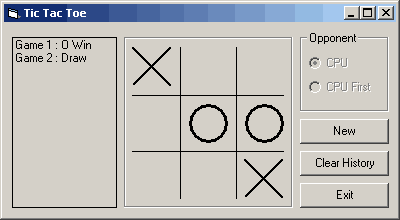



## Tic Tac Toe that learns \(True AI\)

### Description

A simple Tic Tac Toe game that allows you to play against the CPU. This Tic Tac Toe is different from others because the CPU 'learns' from its mistakes and will get smarter as you play more games with it. what makes the CPU 'smart' is actually a weight system which the CPU determines its best move by looking into history of games and determine which move would result in the lowest probability of losing. All the moves are stored in a history file and is loaded whenever the program starts. Initially when the history file is empty, the CPU is really dumb, but each time you win it, it will get smarter.

The initial history file included has all possible winning moves played out, so basically you cannot win the CPU no matter how hard you try. If you let CPU move first, it might win you if you are not careful! This is because the moves the CPU make is also derived from the move history, it choses the moves that yield the best winning chance. It will actually set traps to trap you if you are not careful! To make the CPU dumb again, just delete the "movhis.txt" file.

You can choose to go first or let the CPU go first. but the CPU only 'learns' when it is allowed to start second. The learning process might be a bit weird as the CPU will lose to the same tactic a few times, this is due to the weight decision process, but basically if you train it enough times, it will not lose again.

I rate this as a begineer because I only have less than 6 months VB programming experience. 3 months to be precise! Hopefully it will fit in to this category.

Comments and feedbacks are welcome. And Please rate my work!
 
### More Info
 

             |
---                |---
**Submitted On**   |2001-12-21 00:01:40
**By**             |[JengHowe](https://github.com/Planet-Source-Code/PSCIndex/blob/master/ByAuthor/jenghowe.md)
**Level**          |Beginner
**User Rating**    |4.2 (50 globes from 12 users)
**Compatibility**  |VB 6\.0
**Category**       |[Games](https://github.com/Planet-Source-Code/PSCIndex/blob/master/ByCategory/games__1-38.md)
**World**          |[Visual Basic](https://github.com/Planet-Source-Code/PSCIndex/blob/master/ByWorld/visual-basic.md)
**Archive File**   |[Tic\_Tac\_To4320512202001\.zip](https://github.com/Planet-Source-Code/jenghowe-tic-tac-toe-that-learns-true-ai__1-29945/archive/master.zip)

